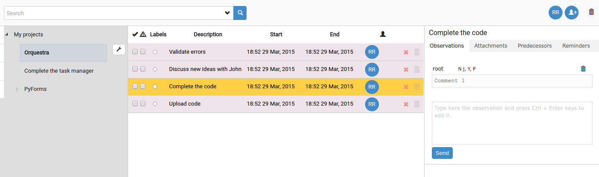

# Tasks manager

Django application to manage tasks.

*++The application is still being developed++*

##Features
* Create tasks.
* Associate labels to the diferent tasks.
* Associate users to tasks.
* Associate files, comments, predecessors and reminders to tasks.
* It is possible to restrict the access of the users to the labels and tasks.